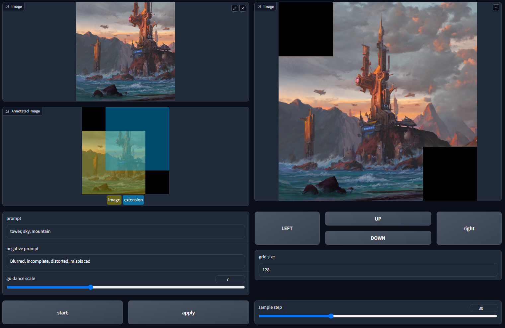
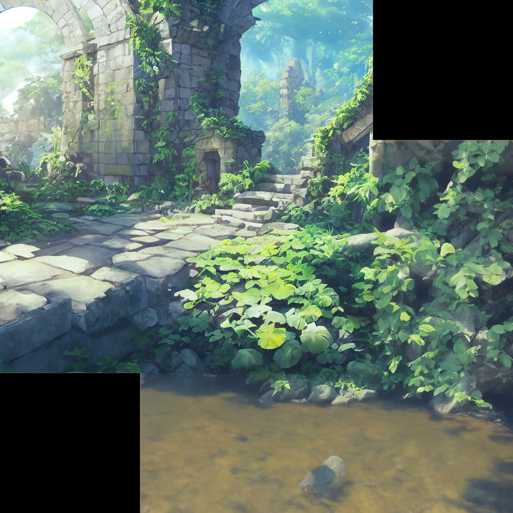

# 一个简单的图像扩展绘画工具(outpainting)

这是一个用于扩展绘画（outpainting）的简单工具，目的在于阐明扩展绘画的原理以及基本的实现方式，旨在通过最少的代码以及必要的技巧实现一个可用的扩展绘画工具。

## 环境说明

代码使用**huggingface**的**diffusers**库进行开发的，所需要的环境依赖见<font color='NavyBlue'> requirements.txt </font>

代码在首次运行时会下载必要的模型文件，请保证网络可用，并保持耐心，如果出现诸如：远程主机终止连接之类的网络问题，请重试。

## 运行

安装运行环境(如果需要虚拟环境（conda等），请先安装虚拟环境，并在虚拟环境中执行以下操作)

```shell
pip install -r requirements.txt
```

工具的入口程序是webUI.py，使用如下命令运行：

```shell
python webUI.py
```

启动后会出现一个本地IP，将其复制到浏览器中即可使用

## 使用

操作界面：


左侧两个图像视图从上到下分别是原始图像，扩展监视器（用于观察需要扩展的位置）；其中扩展监视器中黄色为原始图像区域，蓝色为需要扩展的区域，该区域会与原始图像存在重叠。右侧图像视图为预览区域，外扩完成的图像将显示在这里。prompt中用于填充外扩区域的描述，该描述需要简洁不易过长，支持中文输入(但是效果较差)。negative prompt用于输入负面提示，同样不易过长，多数情况下默认即可。guidance scale用于控制正、负面提示词的区分能力。方向键用于操作扩展区域，可以实现四个方向的移动。grid size用于设置平移的网格大小。sample step是采样步数。start用于开始outpainting；apply用于采用预览区的结果，当预览数据被采用时，原始图像将被更新。

## 注意事项


- 进行扩展时建议只向某个方向扩展，虽然功能上可以实现任意位置的扩展，但是这种操作将限制多次扩展的效果。
- 扩展范围是受限的，目的是保证结果的参考语义足够多。
- 目前使用的权重在风景以及写实类图像上的性能较好。
- 扩展存在一定的随机性，需要多次尝试，并完善prompt，在得到满意结果后保存图像。
- **使用上可能存在不足，欢迎反馈**


## 额外的效果

|原图|扩展结果|
|----|-------|
|||
|||

